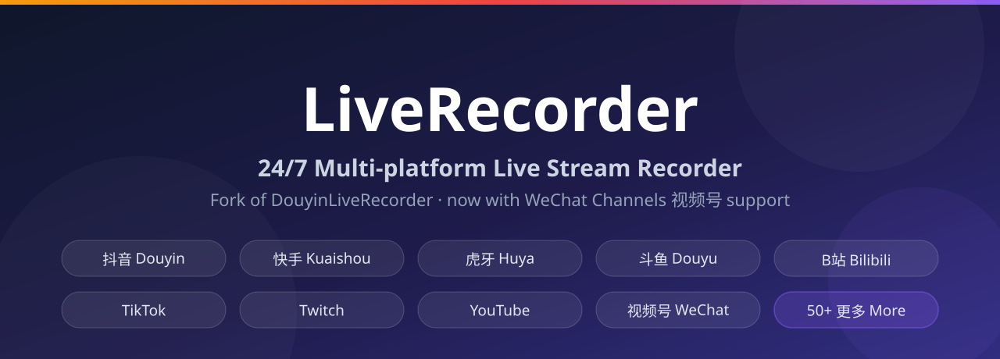

<p align="center">
  <h1 align="center">🎬 LiveRecorder 多平台直播录制工具</h1>
  <p align="center"><strong>基于 FFmpeg 的多平台直播循环值守录制工具，支持 50+ 平台，含微信视频号</strong></p>

  <p align="center">
    <a href="https://github.com/qgeng1465/LiveRecorder"><strong>English</strong></a> ·
    <a href="https://github.com/qgeng1465/LiveRecorder/blob/main/README_CN.md"><strong>中文文档</strong></a>
  </p>

  <p align="center">
    
    
    
    
    
    
  </p>
</p>

<p align="center">
  
</p>

基于 FFmpeg 的**多平台直播循环值守录制工具**：把直播间地址写进配置，程序自动轮询开播状态、录制、断线重连、分段保存、推送开播提醒，支持抖音、快手、虎牙、斗鱼、B站、Twitch、YouTube 等 **50+ 平台**，并新增了**微信视频号**录制支持（上游原版没有的功能）。

本仓库由 [DouyinLiveRecorder](https://github.com/ihmily/DouyinLiveRecorder)（原作者 Hmily，MIT 协议）二次开发而来：**完整保留原版全部录制功能**，并做了以下增强：

- 📱 **微信视频号录制**——通过「投屏伪装」方式取流（半自动）
- ⚡ **常驻 Node 签名进程**——不再每次调用都新起进程，CPU/内存占用大幅降低
- 🪶 **运行时精简**——移除未使用的 ffmpeg 组件与 Node 模块

> ⚠️ 本项目仅供学习交流。录制他人直播前请先获得授权，尊重主播著作权与个人信息。

> ⭐ 如果 LiveRecorder 对你有帮助，请给项目点个 **Star**，让更多人看到。有任何问题欢迎提 issue 和 PR！

---

## ✨ 特性

- 🎯 **50+ 平台录制**：抖音 / TikTok / 快手 / 虎牙 / 斗鱼 / YY / B站 / 小红书 / Twitch / YouTube / 微信视频号 等
- 📱 **微信视频号录制**（本版新增）：通过「投屏伪装」方式取流，半自动录制
- 🔁 **循环值守**：`URL_config.ini` 一行一个直播间，自动轮询开播、录制、断线重连
- 🎞️ **格式灵活**：TS / MP4 / FLV，支持分段录制与 TS 转 MP4
- 📊 **画质可选**：默认原画/蓝光，可逐直播间指定录制画质
- 🔔 **开播推送**：Bark / 邮件 / Telegram / 钉钉 / 微信 / ntfy / PushPlus
- ⚡ **低占用**：JS 签名走常驻 Node 进程（不再反复启动新进程），运行时已精简
- 🌍 **海外平台**：支持代理配置，TikTok / SOOP / Twitch 等可正常录制
- 📦 **跨平台**：Windows / Linux / macOS / Docker 均可运行

---

## 😺 已支持平台

- [x] 抖音
- [x] **微信视频号**（本版新增，半自动）
- [x] TikTok
- [x] 快手
- [x] 虎牙
- [x] 斗鱼
- [x] YY
- [x] B站
- [x] 小红书
- [x] bigo
- [x] blued
- [x] SOOP（原 AfreecaTV）
- [x] 网易cc
- [x] 千度热播
- [x] PandaTV
- [x] 猫耳FM
- [x] Look直播
- [x] WinkTV
- [x] TTingLive（原 Flextv）
- [x] PopkonTV
- [x] TwitCasting
- [x] 百度直播
- [x] 微博直播
- [x] 酷狗直播
- [x] TwitchTV
- [x] LiveMe
- [x] 花椒直播
- [x] 流星直播
- [x] ShowRoom
- [x] Acfun
- [x] 映客直播
- [x] 音播直播
- [x] 知乎直播
- [x] CHZZK
- [x] 嗨秀直播
- [x] vv星球直播
- [x] 17Live
- [x] 浪Live
- [x] 畅聊直播
- [x] 飘飘直播
- [x] 六间房直播
- [x] 乐嗨直播
- [x] 花猫直播
- [x] Shopee
- [x] Youtube
- [x] 淘宝
- [x] 京东
- [x] Faceit
- [x] 咪咕
- [x] 连接直播
- [x] 来秀直播
- [x] Picarto

---

## 📌 环境要求

| 依赖 | 要求 | 说明 |
|---|---|---|
| **Python** | **3.10 及以上** | 必装（代码使用 `str\|None` 等新语法） |
| ffmpeg | 自动安装 | 首次运行自动检测并下载；Windows 自动下载、macOS 走 Homebrew、Linux 走 `yum`/`apt` |
| Node.js | 自动安装 | 抖音等平台的 JS 签名用；首次运行自动检测并下载 |

> 如果自动下载失败（网络原因），可自行安装 ffmpeg 与 Node.js 并加入系统 PATH，程序同样能识别。

---

## 🚀 快速开始

### 安装与启动（Windows / Linux / macOS）

```bash
git clone https://github.com/qgeng1465/LiveRecorder.git
cd LiveRecorder
pip install -r requirements.txt
python main.py          # Windows 用 python，Linux/macOS 可用 python3
```

> **国内用户注意**：pip 直连 PyPI 可能失败，建议使用镜像：
> ```bash
> pip install -r requirements.txt -i https://pypi.tuna.tsinghua.edu.cn/simple
> ```

首次启动会自动完成：
1. 检测 ffmpeg 与 Node.js，缺失则自动下载安装
2. 生成 `config/config.ini`（若缺键自动补齐）
3. 若 `config/URL_config.ini` 为空，会提示你输入第一个直播间地址

**停止录制**：`Ctrl+C`；Windows 也可双击 `StopRecording.vbs`。

### Docker

```bash
docker build -t liverecorder .
docker run -it --name liverecorder \
  -v $(pwd)/config:/app/config \
  -v $(pwd)/downloads:/app/downloads \
  liverecorder
```

或用 docker-compose（基于本仓库 Dockerfile 构建）：

```bash
docker compose up -d
```

---

## ⚙️ 配置说明

程序只读两个配置文件，都在 `config/` 目录下：

### 1. `config/URL_config.ini` —— 录哪些直播间

一行一个直播间地址。规则（均从代码实测）：

| 写法 | 含义 |
|---|---|
| `https://live.douyin.com/xxx` | 用默认画质录制 |
| `超清，https://live.douyin.com/xxx` | 指定该直播间画质 |
| `https://xxx.m3u8` / `https://xxx.flv` | 直接录制自定义流地址 |
| `https://xxx，主播: 名字` | 自定义保存的主播名（视频号格式） |
| 行首加 `#` | 暂停该行，不录制 |

- 分隔符支持英文逗号 `,` 和中文逗号 `，`，可以混用
- 画质取值：`原画` `蓝光` `超清` `高清` `标清` `流畅`
- 每一行可独立指定画质，不填就用全局默认画质
- 地址示例见文末「🎨 直播间链接示例」

### 2. `config/config.ini` —— 全局设置

程序会自动补全缺失的区段和键。**所有「是/否」项只能填 `是` 或 `否`。**

#### [录制设置]

| 配置项 | 说明 | 默认值 |
|---|---|---|
| `language(zh_cn/en)` | 程序界面语言 | `zh_cn` |
| `是否跳过代理检测(是/否)` | 填「是」跳过启动时的系统代理检测，启动更快 | `否` |
| `直播保存路径(不填则默认)` | 录制保存根目录，留空为 `downloads/` | 空 |
| `保存文件夹是否以作者区分` | 按主播名建子目录 | `是` |
| `保存文件夹是否以时间区分` | 按日期建子目录 | `否` |
| `保存文件夹是否以标题区分` | 按直播标题建子目录 | `否` |
| `保存文件名是否包含标题` | 文件名附带直播标题 | `否` |
| `是否去除名称中的表情符号` | 去除 emoji（避免 Windows 非法文件名） | `是` |
| `视频保存格式ts\|mkv\|flv\|mp4\|mp3音频\|m4a音频` | 录制封装格式，可填 `ts` / `mkv` / `flv` / `mp4` / `mp3音频` / `m4a音频` | `ts` |
| `原画\|超清\|高清\|标清\|流畅` | 全局默认录制画质（可被 URL_config 逐行覆盖） | `原画` |
| `是否使用代理ip(是/否)` | 是否启用代理 | `是` |
| `代理地址` | 代理地址，如 `127.0.0.1:7890` 或 `http://127.0.0.1:7890` | 空 |
| `同一时间访问网络的线程数` | 并发解析/请求的线程数 | `3` |
| `循环时间(秒)` | 扫描直播间开播状态的间隔 | `300` |
| `排队读取网址时间(秒)` | 处理网址列表的间隔 | `0` |
| `是否显示循环秒数` | 终端显示下一次循环倒计时 | `否` |
| `是否显示直播源地址` | 终端打印拉流地址 | `否` |
| `分段录制是否开启` | 长直播按时间分段保存 | `是` |
| `是否强制启用https录制` | 强制用 https 拉流 | `否` |
| `录制空间剩余阈值(gb)` | 磁盘剩余空间低于该值（GB）停止录制 | `1.0` |
| `视频分段时间(秒)` | 每段录制的时长 | `1800` |
| `录制完成后自动转为mp4格式` | 录制结束后自动转 mp4 | `是` |
| `mp4格式重新编码为h264` | 转码时重新编码为 h264（兼容性更好） | `否` |
| `追加格式后删除原文件` | 转码完成后删除中间文件 | `是` |
| `生成时间字幕文件` | 生成时间轴字幕文件 | `否` |
| `是否录制完成后执行自定义脚本` | 录制结束后执行脚本 | `否` |
| `自定义脚本执行命令` | 脚本命令（python / bat / bash 等均可） | 空 |
| `使用代理录制的平台(逗号分隔)` | 强制走代理录制的平台列表 | `tiktok, sooplive, ...` |
| `额外使用代理录制的平台(逗号分隔)` | 在上面基础上追加平台 | 空 |

#### [推送配置]

`直播状态推送渠道` 支持多选，用逗号分隔即可，例如 `bark,tg` 或 `bark,tg,微信`（不区分大小写）。可选渠道：`微信` `钉钉` `邮箱` `TG` `BARK` `NTFY` `PUSHPLUS`。

| 配置项 | 说明 |
|---|---|
| `直播状态推送渠道` | 推送渠道多选，如 `bark,tg` |
| `钉钉推送接口链接` | 钉钉机器人 Webhook 地址 |
| `微信推送接口链接` | 微信（Server 酱等）推送接口地址 |
| `bark推送接口链接` | Bark 地址，如 `https://api.day.app/你的key` |
| `bark推送中断级别` | `active` / `timeSensitive` / `passive` |
| `bark推送铃声` | Bark 铃声名称，留空用默认 |
| `钉钉通知@对象(填手机号)` | 钉钉 @ 指定人手机号 |
| `钉钉通知@全体(是/否)` | 钉钉 @ 全体成员 |
| `tgapi令牌` | Telegram Bot Token |
| `tg聊天id(个人或者群组id)` | Telegram 接收推送的 chat id |
| `smtp邮件服务器` | 如 `smtp.qq.com` |
| `是否使用SMTP服务SSL加密(是/否)` | SMTP 是否启用 SSL |
| `SMTP邮件服务器端口` | 如 `465`（SSL）/ `587`（STARTTLS） |
| `邮箱登录账号` | 发件邮箱账号 |
| `发件人密码(授权码)` | SMTP 授权码（**不是**邮箱登录密码） |
| `发件人邮箱` | 发件人邮箱地址 |
| `发件人显示昵称` | 收件人看到的发件人昵称 |
| `收件人邮箱` | 接收推送的邮箱 |
| `ntfy推送地址` | 默认 `https://ntfy.sh/你的主题` |
| `ntfy推送标签` | ntfy 标签（emoji） |
| `ntfy推送邮箱` | 在 ntfy 主题中附带邮箱账号 |
| `pushplus推送token` | PushPlus 微信推送 token |
| `自定义推送标题` | 推送消息标题模板 |
| `自定义开播推送内容` | 开播推送内容模板 |
| `自定义关播推送内容` | 关播推送内容模板 |
| `只推送通知不录制(是/否)` | 只监控并推送、不录制视频 |
| `直播推送检测频率(秒)` | 推送监控检测间隔 | `1800` |
| `开播推送开启(是/否)` | 开播推送开关 | `是` |
| `关播推送开启(是/否)` | 关播推送开关 | `否` |

#### [Cookie]

| 配置项 | 说明 |
|---|---|
| `抖音cookie` | **录制抖音必填**（见下节获取方法） |
| 其他平台的 `xxx_cookie` | 仅当该平台需要登录态时才填 |

#### [Authorization]

| 配置项 | 说明 |
|---|---|
| `popkontv_token` | PopkonTV 的登录 token |

#### [账号密码]

| 配置项 | 说明 |
|---|---|
| `sooplive账号` / `sooplive密码` | SOOP（原 AfreecaTV）登录账号密码 |
| `flextv账号` / `flextv密码` | FlexTV 账号密码 |
| `popkontv账号` / `partner_code` / `popkontv密码` | PopkonTV 账号密码与频道代码 |
| `twitcasting账号类型` / `twitcasting账号` / `twitcasting密码` | TwitCasting 账号（类型 normal / rss 等） |

### 3. 获取抖音 Cookie

抖音录制依赖登录 Cookie：

1. 浏览器登录 https://www.douyin.com
2. 按 `F12` 打开开发者工具 → `Network`（网络）标签
3. 刷新页面，任选一个请求，在 `Request Headers` 里找到 `Cookie: ` 一整行
4. 把 `Cookie:` 后面的**整段值**复制到 `config/config.ini` 的 `[Cookie]` 区段的 `抖音cookie =` 后面
5. 保存后重启程序

> Cookie 会过期，失效时重新获取即可。Cookie 属个人敏感信息，**不要提交到公共仓库**。

### 4. 代理配置

- 在 `[录制设置]` 把 `是否使用代理ip` 填 `是`，`代理地址` 填如 `127.0.0.1:7890`
- 海外平台（TikTok / SOOP / Twitch 等）默认已列入 `使用代理录制的平台` 列表；如你的代理规则无法区分，可在 `额外使用代理录制的平台` 里补充
- 启动时程序会自动检测系统代理（可在 `是否跳过代理检测` 填 `是` 跳过）

---

## 📱 微信视频号录制（本版新增）

视频号没有公开取流接口，直播地址是带时效签名的短链接。本版通过「投屏伪装」方式获取地址后自动录制：

1. 启动录制：`python main.py`
2. **Windows** 双击 `启动视频号取流.bat`，**Linux/macOS** 运行 `python wechat_capture.py`，输入主播名
3. 手机与电脑连**同一 WiFi**
4. 手机微信视频号直播 → 右上角【投屏】→ 选择设备 **MAGI**
5. 脚本捕获到地址后自动写入 `config/URL_config.ini`，程序下一轮循环（默认约 300 秒）自动按「视频号直播」平台录制

录到 `downloads/视频号直播/主播名/`。地址带时效签名，录制中断或失效时重跑取流脚本、再投屏一次即可。

> 取流脚本首次运行会自动 `pip install wechat-finder-dlna`（GPL-3.0 独立工具，仅用于捕获地址，不进入录制程序本体）。若自动安装失败，请手动执行 `python -m pip install wechat-finder-dlna`。

---

## 🧰 从源码打包为单文件夹版（可选）

需要 Python >= 3.10 与 PyInstaller：

```bash
pip install pyinstaller
python -m PyInstaller --onedir --name LiveRecorder \
  --add-data "src/javascript;src/javascript" --add-data "i18n;i18n" main.py
```

> **注意事项**：
> - 需在 `.spec` 中设置 `sys.setrecursionlimit(getrecursionlimit() * 5)`，否则打包会报 RecursionError
> - 若系统 Python 装有数据科学库（tensorflow/torch/numpy/scipy/pandas 等），需在 `Analysis.excludes` 中排除，否则产物会膨胀到数 GB
> - 打包后在 exe 同级目录放置 `config/` 即可使用

---

## ❓ 常见问题（FAQ）

**Q：提示缺少 ffmpeg / Node.js？**
自动下载失败多为网络问题。自行安装 ffmpeg 与 Node.js 并加入系统 PATH 即可：
- ffmpeg：`ffmpeg.org/download.html` 或 `apt install ffmpeg` / `brew install ffmpeg`
- Node.js：`nodejs.org` 或 `brew install node`

**Q：Python 版本要求？**
必须 **3.10 及以上**，更低版本会语法报错。

**Q：抖音录制失败？**
1. 检查 `[Cookie]` 里 `抖音cookie` 是否已填且未过期
2. 检查网络代理是否正常（部分网络需开代理访问抖音）

**Q：录制没有声音 / 格式问题？**
推荐使用默认 `ts` 格式录制（录制完成后自动转 mp4），`ts` 分段录制对断流容错最好。改成 `flv` / `mp4` 直接封装在某些平台会无声或损坏。

**Q：微信视频号地址失效了？**
视频号地址带时效签名，重新运行取流脚本、手机再投屏一次即可，无需重启主程序。

**Q：修改配置后需要重启吗？**
`config/URL_config.ini` 的修改会在下一轮循环自动生效；`config/config.ini` 的修改建议重启程序。

**Q：录制在哪个目录？**
默认 `downloads/平台名/主播名/`，可用 `[录制设置]` 的 `直播保存路径` 修改。

---

## 📁 项目结构

```
LiveRecorder/
├── main.py                 → 主程序入口
├── wechat_capture.py       → 微信视频号取流脚本（可选，半自动）
├── 启动视频号取流.bat        → Windows 一键启动取流脚本
├── StopRecording.vbs       → Windows 一键停止录制
├── ffmpeg_install.py       → ffmpeg 自动检测/安装
├── msg_push.py             → 消息推送（微信/钉钉/tg/邮箱/bark/ntfy/pushplus）
├── i18n.py / i18n/         → 多语言
├── src/
│   ├── spider.py           → 各平台直播流解析（50+ 平台）
│   ├── stream.py           → 录制逻辑
│   ├── room.py             → 抖音房间信息
│   ├── utils.py            → 常驻 Node 签名执行器
│   ├── initializer.py      → Node.js 自动检测/安装
│   ├── javascript/         → JS 签名脚本（x-bogus 等）
│   └── ...
├── config/
│   ├── config.ini          → 全局配置（画质/代理/推送/Cookie）
│   └── URL_config.ini      → 要录制的直播间地址，一行一个
├── downloads/              → 录制视频保存目录（自动创建）
├── Dockerfile / docker-compose.yaml
├── requirements.txt
└── LICENSE
```

---

## 🎨 直播间链接示例

```
抖音:
https://live.douyin.com/745964462470
https://v.douyin.com/iQFeBnt/
https://live.douyin.com/yall1102  （链接+抖音号）
https://v.douyin.com/CeiU5cbX  （主播主页地址）

TikTok:
https://www.tiktok.com/@pearlgaga88/live

快手:
https://live.kuaishou.com/u/yall1102

虎牙:
https://www.huya.com/52333

斗鱼:
https://www.douyu.com/3637778?dyshid=
https://www.douyu.com/topic/wzDBLS6?rid=4921614&dyshid=

YY:
https://www.yy.com/22490906/22490906

B站:
https://live.bilibili.com/320

小红书（直播间分享地址）:
http://xhslink.com/xpJpfM

bigo直播:
https://www.bigo.tv/cn/716418802

blued直播:
https://app.blued.cn/live?id=Mp6G2R

SOOP:
https://play.sooplive.co.kr/sw7love

网易cc:
https://cc.163.com/583946984

千度热播:
https://qiandurebo.com/web/video.php?roomnumber=33333

PandaTV:
https://www.pandalive.co.kr/live/play/bara0109

猫耳FM:
https://fm.missevan.com/live/868895007

Look直播:
https://look.163.com/live?id=65108820&position=3

WinkTV:
https://www.winktv.co.kr/live/play/anjer1004

FlexTV(TTinglive):
https://www.flextv.co.kr/channels/593127/live

PopkonTV:
https://www.popkontv.com/live/view?castId=wjfal007&partnerCode=P-00117

TwitCasting:
https://twitcasting.tv/c:uonq

百度直播:
https://live.baidu.com/m/media/pclive/pchome/live.html?room_id=9175031377&tab_category

微博直播:
https://weibo.com/l/wblive/p/show/1022:2321325026370190442592

酷狗直播:
https://fanxing2.kugou.com/50428671?refer=2177&sourceFrom=

TwitchTV:
https://www.twitch.tv/gamerbee

LiveMe:
https://www.liveme.com/zh/v/17141543493018047815/index.html

花椒直播:
https://www.huajiao.com/l/345096174

流星直播:
https://www.7u66.com/100960

ShowRoom:
https://www.showroom-live.com/room/profile?room_id=480206  （主播主页地址）

Acfun:
https://live.acfun.cn/live/179922

映客直播:
https://www.inke.cn/liveroom/index.html?uid=22954469&id=1720860391070904

音播直播:
https://live.ybw1666.com/800002949

知乎直播:
https://www.zhihu.com/people/ac3a467005c5d20381a82230101308e9 （主播主页地址）

CHZZK:
https://chzzk.naver.com/live/458f6ec20b034f49e0fc6d03921646d2

嗨秀直播:
https://www.haixiutv.com/6095106

VV星球直播:
https://h5webcdn-pro.vvxqiu.com//activity/videoShare/videoShare.html?h5Server=https://h5p.vvxqiu.com&roomId=LP115924473&platformId=vvstar

17Live:
https://17.live/en/live/6302408

浪Live:
https://www.lang.live/en-US/room/3349463

畅聊直播:
https://live.tlclw.com/106188

飘飘直播:
https://m.pp.weimipopo.com/live/preview.html?uid=91648673&anchorUid=91625862&app=plpl

六间房直播:
https://v.6.cn/634435

乐嗨直播:
https://www.lehaitv.com/8059096

花猫直播:
https://h.catshow168.com/live/preview.html?uid=19066357&anchorUid=18895331

Shopee:
https://sg.shp.ee/GmpXeuf?uid=1006401066&session=802458

Youtube:
https://www.youtube.com/watch?v=cS6zS5hi1w0

淘宝（需 cookie）:
https://tbzb.taobao.com/live?liveId=532359023188
https://m.tb.cn/h.TWp0HTd

京东:
https://3.cn/28MLBy-E

Faceit:
https://www.faceit.com/zh/players/Compl1/stream

连接直播:
https://show.lailianjie.com/10000258

咪咕直播:
https://www.miguvideo.com/p/live/120000541321

来秀直播:
https://www.imkktv.com/h5/share/video.html?uid=1845195&roomId=1710496

Picarto:
https://www.picarto.tv/cuteavalanche
```

---

## 📜 更新日志

### 本仓库（LiveRecorder）

- **2026-08** · 首个 fork 版本（基于上游 v4.0.7）
  - 新增微信视频号录制（投屏伪装取流，半自动）
  - JS 签名改为常驻 Node 进程，降低 CPU/内存占用
  - 精简运行时（移除 ffplay/ffprobe、npm 等），体积减小约 35MB
  - 完整保留上游全部录制功能

### 上游 DouyinLiveRecorder

<details><summary>点击展开（作者 Hmily 的更新历史，完整版见原仓库）</summary>

- 20251024
  - 修复抖音风控无法获取数据问题
  - 新增 soop.com 录制支持
  - 修复 bigo 录制
- 20250127
  - 新增淘宝、京东、faceit 直播录制
  - 修复小红书直播流录制以及转码问题
  - 修复畅聊、VV星球、flexTV 直播录制
  - 修复批量微信直播推送
  - 新增 email 发送 ssl 和 port 配置
  - 新增强制转 h264 配置
  - 更新 ffmpeg 版本
  - 重构包为异步函数
- 20241130
  - 新增 shopee、youtube 直播录制
  - 新增支持自定义 m3u8、flv 地址录制
  - 新增自定义执行脚本，支持 python、bat、bash 等
  - 修复 YY直播、花椒直播和小红书直播录制
- 20241030
  - 新增嗨秀直播、vv星球直播、17Live、浪Live、SOOP、畅聊直播、飘飘直播、六间房直播、乐嗨直播、花猫直播等 10 个平台
  - 修复小红书直播录制，支持作者主页地址
  - 新增 ntfy 消息推送
  - 修复 LiveMe、twitch 直播录制
  - 新增 Windows 一键停止录制 VB 脚本
- 20241005
  - 新增邮箱和 Bark 推送
  - 新增直播注释停止录制
  - 优化分段录制
- 20240928
  - 新增知乎直播、CHZZK 直播录制
- 20240903
  - 新增抖音双屏录制、音播直播录制
- 20240701
  - 修复虎牙 2 分钟断流；新增自定义推送内容
- 20240621
  - 新增 Acfun、ShowRoom 录制；修复斗鱼 60 帧、TikTok 解析等
- 20240427
  - 新增 LiveMe、花椒直播录制
- 20240425
  - 新增 TwitchTV 直播录制
- 20240424
  - 新增酷狗直播；修复斗鱼回放问题
- 20240423
  - 新增百度直播、微博直播
- 20240311
  - 修复海外平台录制 bug，增加画质选择
- 20240209
  - 优化 AfreecaTV 登录；修复小红书直播域名
- 20240129
  - 新增猫耳FM直播录制
- 20240127
  - 新增千度热播、PandaTV；新增 telegram 推送
- 20231210
  - 新增 AfreecaTV；修复分段录制
- 20231207
  - 新增 blued、直播结束推送
- 20231206
  - 新增 bigo 直播录制
- 20231203
  - 新增小红书直播录制（全网首发）
- 20230930
  - 抖音改从官方接口获取直播流；快手改官方接口
- 20230814
  - 新增 B站直播录制；在线播放 M3U8/FLV 网页
- 20230805
  - 新增虎牙直播录制
- 20230804
  - 新增快手直播录制；抖音 cookie 自动化获取
- 20230803
  - 新增 TikTok 直播录制

</details>

---

## 📄 开源许可

本项目使用 [MIT](LICENSE) 协议。

- **上游项目**：[DouyinLiveRecorder](https://github.com/ihmily/DouyinLiveRecorder)，原作者 **Hmily**，MIT 协议
- **本 fork 维护**：qgeng1465，Copyright (c) 2026

感谢 Hmily 的开源贡献。使用本项目时请遵守 MIT 协议条款，保留版权声明。
